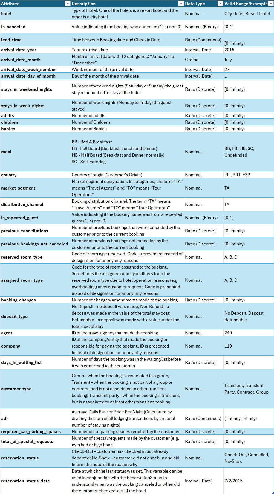

# DS514/515
# Analyzing Factors Influencing Hotel Booking Cancellations to Enhance Sales Strategy

## Hotel Cancellation Model – Overview

This project builds a predictive model to estimate whether a hotel booking will be cancelled, enabling better demand forecasting and inventory management.

## Data Source  
Kaggle Notebook: “EDA of bookings and ML to predict cancelations”  
Source link: https://www.kaggle.com/datasets/mojtaba142/hotel-booking
- **Total Rows:** 119,390 records  
- **Total Columns:** 32 features  

### Description  
The dataset contains hotel booking information from **two hotels in Portugal**:  
- Resort Hotel (Algarve)  
- City Hotel (Lisbon)

It includes bookings with arrival dates between:  
**July 1, 2015 – August 31, 2017**

These records cover customer booking details, cancellations, demographics, market segments, seasonal patterns, and more.

### Data Dictionary  

---

## End-to-End Workflow

The modeling workflow consists of five main stages:

1. **Load Data**
   - Source: Public *Hotel Booking Demand* dataset (Kaggle), loaded as CSV.
   - Initial size: **119,390 rows**, **32 columns**.
   - Key raw columns include `hotel`, `is_canceled`, `lead_time`, `arrival_date_*`, `stays_in_weekend_nights`, `stays_in_week_nights`, `adults`, `children`, `babies`, `meal`, `country`, `market_segment`, `distribution_channel`, `is_repeated_guest`, `previous_cancellations`, `previous_bookings_not_canceled`, `reserved_room_type`, `deposit_type`, `agent`, `company`, `days_in_waiting_list`, `customer_type`, `adr`, `required_car_parking_spaces`, `total_of_special_requests`, `reservation_status`, `reservation_status_date`, `total_guest`.

2. **Clean Data**
   - Remove:
     - Duplicate records
     - Rows with missing / NULL values (where appropriate)
   - Adjust column types to appropriate dtypes (e.g., dates, integers, categories).
   - Drop low-value / sparse ID-like columns:
     - `agent`
     - `company`
   - Result after cleaning:
     - **87,108 rows**
     - **30 columns**

3. **Feature Engineering & Selection**
   - Drop columns not available at booking time or not useful for prediction:
     - `reservation_status`
     - `reservation_status_date`
   - Add new engineered features:
     - `total_guest` = `adults` + `children` + `babies`
   - Define:
     - **Target:** `is_canceled`
     - **Features:** All remaining columns except `is_canceled`
   - Shape after feature selection:
     - **87,108 rows**
     - **29 columns**

4. **Modeling**
   - **Train/Test Split** to evaluate generalization performance.
   - Build a **scikit-learn Pipeline**:
     - **Preprocessor:** Column transformer to handle:
       - Numeric features (scaling)
       - Categorical features (encoding)
     - **Classifier candidates:** KNN, Logistic Regression, XGBoost
   - **Model selection via GridSearchCV**:
     - Cross-validation used to find best hyperparameters.
     - Objective: maximize performance on cancellation prediction, with emphasis on recall for the cancellation class.

5. **Evaluation**
   - Metrics:
     - Classification report (precision, recall, F1-score)
     - Confusion matrix
     - ROC-AUC on test data
   - Primary focus: **Recall for the cancellation class (1)** to reduce missed cancellations.
   - Visualizations:
     - Training vs. test performance curves
     - Confusion matrix heatmap
     - Performance on unseen data

---

## XGBoost Model Performance

The best-performing model from the experiments was **XGBoost**.

**Confusion Matrix**

- **Accuracy:** **0.85** (highest among tested models)
- **Recall (Cancellation Class = 1):** **0.67** (highest among all models)
- **Key Hyperparameters (optimized via GridSearchCV):**
  - `learning_rate`: **0.1**
  - `max_depth`: **13**
  - `n_estimators`: **600**
- **Generalization:**
  - Performance on unseen data remains strong

    

---

## Insights & Next Steps

### 1. Data Imbalance

- Only about **~20%** of bookings are cancelled (exact percentage to be confirmed), leading to a **class imbalance** problem.

**Next Steps:**

- Experiment with imbalance-handling techniques:
  - Oversampling (e.g., SMOTE) or undersampling strategies.
- Collect more examples of cancelled bookings to further strengthen the minority class signal.

### 2. Cancellation Probability Model

- Move beyond binary prediction to a **probability-based model**:
  - Output: Probability of cancellation for each booking.
- Business applications:
  - Overbooking strategies
  - Dynamic pricing and promotion targeting
  - Prioritization of risky bookings for manual review or communication.

**Next Steps:**

- Calibrate predicted probabilities (e.g., Platt scaling or isotonic regression).
- Work with stakeholders to define decision thresholds (e.g., at what probability of cancellation to trigger an action).

---

**Model Performance Curves**

