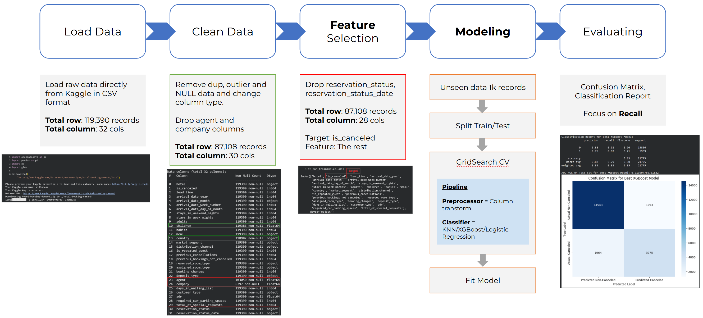
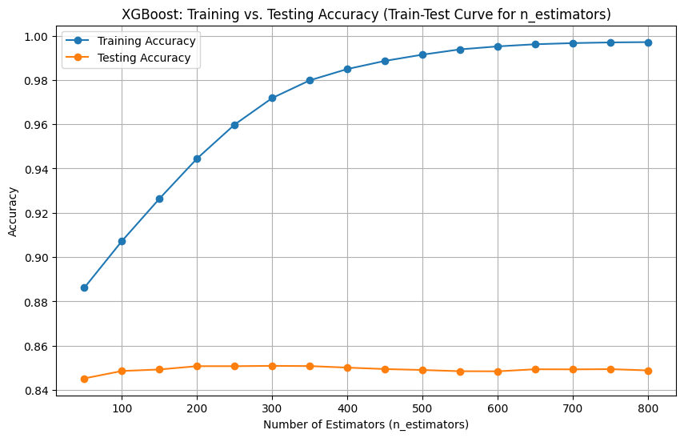

# DS512/513 "Analyzing Factors Influencing Hotel Booking Cancellations to Enhance Sales Strategy"
## Hotel Booking - Overview
   The hotel industry is rapidly transforming as digital platforms make booking easier and more convenient for guests. While this brings new opportunities, it also creates challenges, especially for hotels that want to reduce reliance on third-party platforms and manage bookings more efficiently. 

   One major issue is the rising rate of booking cancellations, which impacts revenue and room planning. This project analyzes hotel booking data to uncover the key factors driving cancellations and provide insights that help hotels improve forecasting, operations, and profitability.
   
---
## Problem Statement & Key Questions
 1. Which countries have the highest and lowest cancellation rates among the Top 10 booking countries?
 2. How do customer type, market segment, deposit type, and distribution channel influence the likelihood of booking cancellations, and which groups exhibit the  highest cancellation risk?
 3. Which features (lead time, ADR, room type, customer type, etc.) show the strongest relationship with cancellation?
   - Does longer lead time significantly increase the likelihood of cancellation?
   - Are price-sensitive customers (high ADR or discounts) more likely to cancel?
   - Does longer stay increase cancellation rate?
     
One major issue is the rising rate of booking cancellations, which impacts revenue and room planning. This project analyzes hotel booking data to uncover the key factors driving cancellations and provide insights that help hotels improve forecasting, operations, and profitability.

---
## Value Propositions
   Our analysis identifies the key factors that most strongly influence booking cancellations, such as lead time and ADR, enabling hotel owners to optimize revenue planning, allocate staff efficiently, and reduce operational uncertainty.

With data-driven strategies informed by the cancellation model, the hotel is expected to increase revenue by up to 30% within 6 months.

---
## Dataset Description
   This dataset contains 119390 observations for a City Hotel and a Resort Hotel. Each observation represents a hotel booking between the 1st of July 2015 and 31st of August 2017, including booking that effectively arrived and booking that were canceled.

---
## Data Dictionary

---
# Exploratory Data Analysis (EDA)
---
## Data Cleaning & Preparation
- Remove:
     - Duplicate records
     - Rows with missing / NULL values (where appropriate)
     - Outliers (extreme ADR values)
- Adjust column types to appropriate dtypes (e.g., dates, integers, categories).
- Creating Total Guests (Adult + Children + Babies)
- Result after cleaning:
     - **87,110 rows**
     - **30 columns**

---
# Data Analysis & Key Findings

---
**1. Top 10 Countries by Cancellation Rates**

Map of top booking countries
Stacked bar chart: Canceled vs Not Canceled for Top 10 countries

**Key Findings:**
1. Brazil, Italy, and Portugal show the highest cancellation ratios (≥30%).
2. High booking volume ≠ high cancellation rate.
3. Countries like France, UK, Germany have high total bookings but lower cancellation percentages (<25%).
4. Western Europe remains the hotel’s core market, but targeted strategies may be required for countries with unstable booking behavior.
5. Countries with high cancellation propensity should be flagged as High-Risk Market Segments for more controlled booking policies.

**Summarize:**
Italy, Brazil, and Portugal show the highest cancellation rates despite high booking volumes, while Germany, the UK, and the Netherlands remain the most stable markets.

---
**2. Customer Type, Market Segment, Deposit Type, and Distribution Channel**

Visualization: Multiple stacked bar charts

**Key Findings:**
1. Customer Type: Transient customers have the highest cancellation rate (≈30%).
2. Market Segment: Online TA (Online Travel Agencies) shows the highest cancellation rate (≈35%).
3. Deposit Type:No-Refund bookings have extremely high cancellation rates (>95%).
4. Distribution Channel:TA/TO (Travel Agents / Tour Operators) shows high cancellation rates (>30%).

**Summarize:**
- Cancellation tendency depends heavily on: who books (customer type), how they book (distribution channel), payment conditions (deposit type)
- The riskiest groups are: Online TAม TA/TO, Transient customers and No-refund deposit bookings

---
**3.Correlation**

Visualization: Pearson correlation table

**Key Findings:** 
  Strongest relationships with cancellation 
   1. Lead Time
   2. ADR
   3. Stay in week night 
   4. Total Guests
      
**Summarize:**
Lead time and ADR are the most influential positive predictors of cancellation in this dataset

---
**4. Lead Time vs Cancellation**

Visualization: Histogram + Boxplot comparing Lead Time for Canceled vs Not Canceled bookings.

**Key Findings:**
1. Canceled bookings have substantially higher Lead Time compared to non-canceled bookings.
2. The median Lead Time for canceled bookings is around 55–60 days, which is higher than the median for non-canceled bookings (approximately 35–40 days).
3. Guests who book far in advance tend to cancel more frequently.
4. Long lead times may indicate uncertainty or flexible travel plans, increasing likelihood of cancellation.

**Summarize:**
Guests who book far in advance tend to cancel more frequently.

---
**5. ADR (Average Daily Rate) vs Cancellation**

Visualization: Bar chart showing average ADR for each cancellation group
Boxplot + histogram for ADR distribution

**Key Findings:**
1. Canceled bookings also peak around 70–150, but show more bookings in higher ADR ranges compared to non-canceled.
2. Canceled bookings have ~18% higher ADR.
3. High-value bookings (ADR > 400) appear mostly in the canceled group.
4. Suggests price sensitivity increases cancellation likelihood.

**Summarize:**
Higher ADR bookings show a higher cancellation tendency, with canceled reservations having ~18% higher ADR on average and a wider distribution, indicating high-priced bookings are more likely to be canceled.

---
**6. Length of Stay (Week Nights) vs Cancellation**

Visualization: Boxplot comparing week-night stays and Histogram of stay durations

**Key Findings:**
1. Canceled bookings also peak around 1–4 nights, similar to non-canceled.However, the distribution shows more bookings in higher night counts (5–7 nights) compared to non-canceled.
2. Medians are similar for both groups, but overall, cancellation likelihood increases as week-night stays increase.
3. Long-stay bookings exhibit higher risk.

**Summarize:**
Cancellation rates rise as week-night stays increase. Long-stay bookings show the highest cancellation risk, while short stays remain more stable.

---
**7. Total Guests vs Cancellation**

Visualization:Boxplot showing total guests vs cancellation and Histogram for group size distribution

**Key Findings:**
1. Most cancellations occur among small groups (1–4 guests).
2. Very large groups (20–55 guests) appear only in the canceled group → potential data entry errors or high-risk group behavior.
3. Total guests is a weak predictor, except for extreme outliers.

**Summarize:**
Total Guests is a weak predictor, except for extreme outliers (large groups), which tend to cancel more frequently.

---
**8. Forecast of Monthly Booking Cancellations**

Visualization: Line chart with forecast shading
- Shows upward trend of cancellations
- Peak cancellations during March–May
- Highest value: ~5,734 cancellations in May 2018

**Key Findings:**
1. Cancellations rise steadily across the years, especially through 2018.
2. Guests typically cancel 1–3 months before travel, explaining the peak in spring (Mar–May).
3. Although Portugal’s tourist high season = June–August, cancellations peak before the actual travel period.
4. Customers may shop around during early months and cancel early bookings.
5. Hotels should adjust deposit or lead-time policies in high-risk months.

---
## **Summarize**

**Key behavioral patterns identified:**
1. It was found that as the lead time increases, the likelihood of a booking being canceled also rises.
2. A higher Average Daily Rate (ADR) also tends to increase the chance that customers will cancel their reservations.
3. Countries with the highest cancellation rates include Italy, Brazil, and Portugal.
4. Small groups and transient customers cancel more frequently.
5. Online Travel Agencies and non-refundable bookings have the highest cancellation risks.
6. Seasonal patterns show cancellation clusters during March–May.
7. High-value bookings (high ADR) are more likely to be canceled.
8. Long-stay reservations are disproportionately represented among canceled bookings.

---
## **Recommendation/Action**

1. Reduce the maximum advance booking period to no more than 360 days (from two years to one year).
2. Adjust booking strategies by requiring a 30% deposit at the time of reservation or shortening the payment deadline, especially for high-risk segments such as OTA bookings, long lead-time reservations, high-ADR bookings, and guests fr
3. Provide flexible pricing or perks for high-ADR bookings to reduce price sensitivity.
4. Apply stricter cancellation or deposit policies to countries with historically high cancellation rates.
5. Negotiate terms with OTAs for stricter cancellation rules.
6. Offer direct-booking benefits to shift customers from OTA channels.
7. Require partial prepayment for reservations > 7 nights.
8. Provide stay packages or discounts to lock in longer stays.
9. March–May is a critical risk window for revenue loss.
    - Shortening payment deadlines
    - Implementing stricter deposit requirements
    - Offering price incentives to secure bookings earlier
11. Improve customer communication by implementing automated reminders and pre-stay confirmations.
12. Develop a machine learning model to predict booking cancellations.

---
## **Impact**
1. Reduces revenue loss from customers who cancel "early-booked rooms."
2. Increases retention among high-value bookings.
3. Reduction in cancellations from markets with unstable booking behavior.
4. Lower cancellations from the highest-risk booking channel.
5. Protects potential revenue lost from canceled long-duration stays.
6. Reduce unintentional cancellations and decrease the incidence of no-shows

# DS514/515

## Hotel Cancellation Model – Overview

This project builds a predictive model to estimate whether a hotel booking will be cancelled, enabling better demand forecasting and inventory management.

---

## End-to-End Workflow

The modeling workflow consists of five main stages:

1. **Load Data**
   - Source: Public *Hotel Booking Demand* dataset (Kaggle), loaded as CSV.
   - Initial size: **119,390 rows**, **32 columns**.
   - Key raw columns include `hotel`, `is_canceled`, `lead_time`, `arrival_date_*`, `stays_in_weekend_nights`, `stays_in_week_nights`, `adults`, `children`, `babies`, `meal`, `country`, `market_segment`, `distribution_channel`, `is_repeated_guest`, `previous_cancellations`, `previous_bookings_not_canceled`, `reserved_room_type`, `deposit_type`, `agent`, `company`, `days_in_waiting_list`, `customer_type`, `adr`, `required_car_parking_spaces`, `total_of_special_requests`, `reservation_status`, `reservation_status_date`, `total_guest`.

2. **Clean Data**
   - Remove:
     - Duplicate records
     - Rows with missing / NULL values (where appropriate)
   - Adjust column types to appropriate dtypes (e.g., dates, integers, categories).
   - Drop low-value / sparse ID-like columns:
     - `agent`
     - `company`
   - Result after cleaning:
     - **87,110 rows**
     - **30 columns**

3. **Feature Engineering & Selection**
   - Drop columns not available at booking time or not useful for prediction:
     - `reservation_status`
     - `reservation_status_date`
   - Add new engineered features:
     - `total_guest` = `adults` + `children` + `babies`
   - Define:
     - **Target:** `is_canceled`
     - **Features:** All remaining columns except `is_canceled`
   - Shape after feature selection:
     - **87,110 rows**
     - **29 columns**

4. **Modeling**
   - **Train/Test Split** to evaluate generalization performance.
   - Build a **scikit-learn Pipeline**:
     - **Preprocessor:** Column transformer to handle:
       - Numeric features (scaling)
       - Categorical features (encoding)
     - **Classifier candidates:** KNN, Logistic Regression, XGBoost
   - **Model selection via GridSearchCV**:
     - Cross-validation used to find best hyperparameters.
     - Objective: maximize performance on cancellation prediction, with emphasis on recall for the cancellation class.

5. **Evaluation**
   - Metrics:
     - Classification report (precision, recall, F1-score)
     - Confusion matrix
     - ROC-AUC on test data
   - Primary focus: **Recall for the cancellation class (1)** to reduce missed cancellations.
   - Visualizations:
     - Training vs. test performance curves
     - Confusion matrix heatmap
     - Performance on unseen data

---

## XGBoost Model Performance

The best-performing model from the experiments was **XGBoost**.

- **Accuracy:** **0.85** (highest among tested models)
- **Recall (Cancellation Class = 1):** **0.67** (highest among all models)
- **Key Hyperparameters (optimized via GridSearchCV):**
  - `learning_rate`: **0.1**
  - `max_depth`: **13**
  - `n_estimators`: **600**
- **Generalization:**
  - Performance on unseen data remains strong

---

## Insights & Next Steps

### 1. Data Imbalance

- Only about **~20%** of bookings are cancelled (exact percentage to be confirmed), leading to a **class imbalance** problem.

**Next Steps:**

- Experiment with imbalance-handling techniques:
  - Oversampling (e.g., SMOTE) or undersampling strategies.
- Collect more examples of cancelled bookings to further strengthen the minority class signal.

### 2. Cancellation Probability Model

- Move beyond binary prediction to a **probability-based model**:
  - Output: Probability of cancellation for each booking.
- Business applications:
  - Overbooking strategies
  - Dynamic pricing and promotion targeting
  - Prioritization of risky bookings for manual review or communication.

**Next Steps:**

- Calibrate predicted probabilities (e.g., Platt scaling or isotonic regression).
- Work with stakeholders to define decision thresholds (e.g., at what probability of cancellation to trigger an action).

---

## Visual Results

**Model Performance Curves**

**Confusion Matrix**

**Unseen Data Evaluation**

